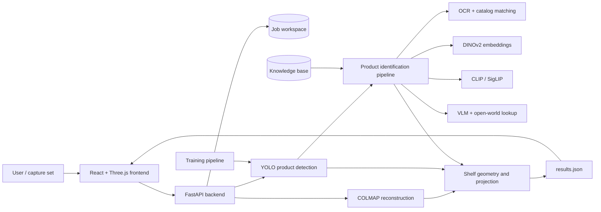

# Architecture and Next Steps

## System purpose

Digital Twin Shelf Mapper turns a set of retail-shelf photographs into an
interactive 3D shelf representation. It reconstructs camera geometry, detects
products, identifies SKUs, estimates shelf structure, projects detections into
3D, and exposes the result through a web viewer.

## High-level architecture

## Runtime components

### Frontend

The Vite application in `frontend/` uses React, React Three Fiber, Drei, and
Three.js. It provides:

- job creation and image upload;
- analysis status polling;
- fixture-template and scale calibration;
- shelf and product filtering;
- point-cloud, wireframe, ray, marker, and dimension overlays;
- inspection of product identity and placement metadata.

`frontend/src/api.js` is the HTTP boundary. `frontend/src/App.jsx` owns the
workflow and application state, while `frontend/src/components/SceneViewer.jsx`
renders the 3D result.

### API and job orchestration

`backend/main.py` is the FastAPI entry point. Each job is isolated under
`backend/workspace/<job-id>/`. The API creates jobs, accepts image uploads,
stores layout calibration, starts analysis, reports progress, and serves
workspace results.

The current background-job state is held in process memory. Generated job files
on disk are the durable record; process status itself is not durable.

### Reconstruction and geometry

The reconstruction path uses COLMAP when a job does not already contain an
exported sparse model. `backend/colmap_text.py` reads the resulting camera,
image, and point data. `backend/dense_reconstruction.py` can augment this path
with depth estimation.

`backend/geometry.py` fits shelf planes, builds rack geometry, applies fixture
and scale calibration, and projects 2D detections into the reconstructed 3D
coordinate system. The backend serializes shelves, products, reconstruction
metadata, and summary records into `results.json`.

### Detection and product identity

`backend/detector.py` runs the bundled shelf-product YOLO checkpoint when it is
available and falls back to a configurable YOLO model. It stores detection
metadata and crops in the job workspace.

`backend/product_identifier.py` coordinates a staged identity pipeline:

1. OCR and catalog alias matching;
2. DINOv2 visual embedding matching;
3. CLIP/SigLIP matching;
4. catalog vision-language-model fallback;
5. open-world identification and Open Food Facts verification.

The reference catalog lives in `backend/knowledge_base/`. Stable SKU class IDs
are maintained in `classes.json`; `catalog.json` supplies aliases and catalog
metadata. Expensive reference indexes are cached in memory and periodically
rescanned for knowledge-base changes.

### Training and model promotion

`training/` contains tools to build YOLO datasets from workspace jobs, convert
SKU-110K, register catalog products, train custom models, and promote a trained
checkpoint into `backend/models/`. Both generic product-box and per-SKU dataset
workflows are supported.

### Deployment

`docker-compose.yml` runs two containers:

- the FastAPI/COLMAP backend on port `8081`;
- the Vite frontend on port `5173`, proxying API traffic to the backend.

Model weights, local environments, build outputs, runtime workspaces, Blender
files, and archives are intentionally excluded from Git. A deployed instance
must obtain model weights and persistent workspace storage separately.

## Main data flow

1. The user creates a job and uploads shelf photographs.
2. The backend creates or loads COLMAP reconstruction data.
3. YOLO detects product packages and writes detection crops.
4. The identification stages attach canonical names, class IDs, provenance,
   and confidence to detections.
5. Geometry processing estimates the rack and shelf planes.
6. Detections are projected into 3D and aggregated into class records.
7. The backend writes `results.json`.
8. The frontend fetches the result and renders the measurable digital twin.

## Current architectural risks

- Job state and execution are process-local, so restarts lose status and
  multi-worker deployments can disagree.
- The filesystem workspace is not an object-store-backed durable job store.
- CPU/GPU-heavy reconstruction and inference run behind the API service rather
  than through a dedicated worker queue.
- CORS currently permits every origin.
- Model artifacts are not versioned or fetched through a reproducible model
  registry.
- Automated coverage for API workflows, geometry, recognition thresholds, and
  frontend behavior is limited.
- Recognition quality depends heavily on catalog coverage and capture quality.

## Recommended next steps

### 1. Make the pipeline reproducible

- Add a model-download script and checksum/version manifest.
- Pin Python dependencies with a lock file.
- Add a small, redistributable fixture job for smoke tests.
- Record pipeline, model, catalog, and configuration versions in every result.

### 2. Add automated quality gates

- Add unit tests for COLMAP parsing, coordinate transforms, shelf fitting, and
  class-record aggregation.
- Add API integration tests for job creation, upload, analysis, and failures.
- Add frontend component tests and one end-to-end happy-path test.
- Run linting, tests, and container builds in GitHub Actions.

### 3. Separate API orchestration from compute

- Move reconstruction and inference into durable queued workers.
- Persist job state and errors in a database.
- Make analysis idempotent and resumable by pipeline stage.
- Add cancellation, timeouts, retry policies, and structured progress events.

### 4. Introduce durable artifact storage

- Store uploaded images and generated artifacts in S3-compatible object storage.
- Use lifecycle policies for temporary crops and reconstruction intermediates.
- Keep only metadata and object keys in the database.
- Use signed URLs instead of exposing a local workspace directly.

### 5. Improve recognition accuracy

- Build a manually reviewed evaluation set across front, angled, occluded, and
  low-light views.
- Track detection recall, identification top-1 accuracy, unknown rate, and 3D
  placement error by release.
- Calibrate confidence thresholds from evaluation data.
- Expand multi-view catalog references and feed reviewed unknowns back into
  training.

### 6. Production hardening

- Add authentication and per-tenant job authorization.
- Restrict CORS and validate upload size, count, and file content.
- Add observability for latency, GPU/CPU usage, stage failures, and model drift.
- Scan dependencies and containers, and keep secrets outside the repository.
- Define backup, retention, and deletion policies for customer imagery.

### 7. Product workflow

- Add a capture-quality check before reconstruction.
- Surface per-stage confidence and correction controls in the UI.
- Allow users to correct SKU identity and shelf placement.
- Export planograms and structured inventory deltas from reviewed results.

## Suggested delivery order

The first production milestone should combine reproducible model provisioning,
a small regression dataset, CI, durable object storage, and a queued worker.
After that foundation is stable, optimize recognition accuracy and add the
human-review workflow. Authentication, tenant isolation, observability, and
retention controls should be complete before customer imagery is handled.
